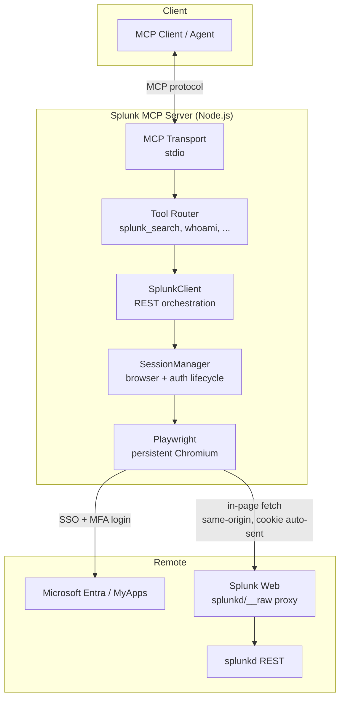
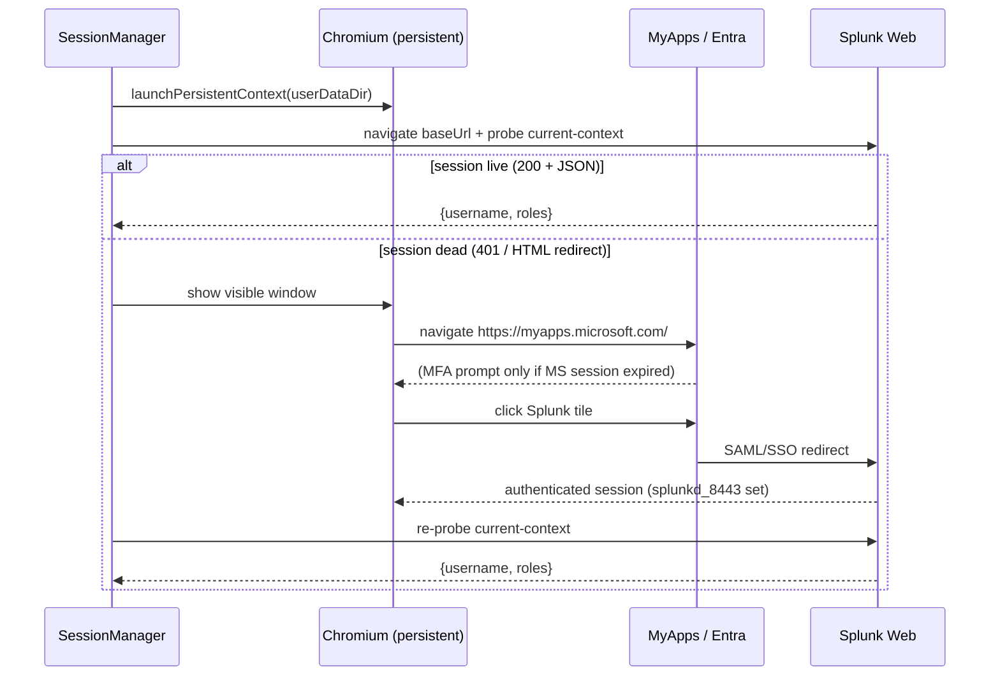
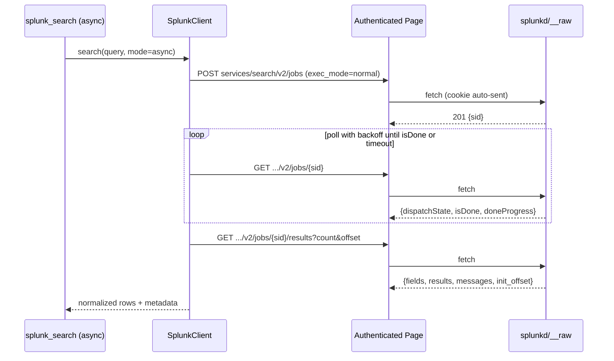

# Design Document: Splunk MCP Server

## Overview

The Splunk MCP Server is a self-contained Node.js MCP (Model Context Protocol) server that lets an agent run Splunk searches and read results against a Splunk Cloud deployment (validated against `https://hoopp.splunkcloud.com`, build `10.5.2605.6`). The organization has **disabled Splunk API tokens**, and authentication is an interactive Microsoft Entra (Azure AD) SSO + MFA flow with no service-account path. To work within those constraints, the server treats an **authenticated browser session as the source of auth**: a human logs in once via the browser, and the server reuses that session to drive Splunk's REST layer.

The core technical insight — validated live — is the **in-page fetch model**: REST calls are executed from inside the authenticated Splunk Web page context (Playwright `page.evaluate` running `fetch`). Because those calls are same-origin, the `HttpOnly` `splunkd_8443` session cookie is attached automatically by the browser and never has to be extracted or handled by our code. The CSRF token is read dynamically at call time from the readable `splunkweb_csrf_token_8443` cookie (or omitted, since same-origin POSTs were observed to succeed without it).

The server owns a Playwright-managed Chromium browser launched with a **persistent user-data-dir**, so the Microsoft SSO session survives across restarts and Splunk re-auth is usually silent. It is fully self-contained (no dependency on any external MCP server; Playwright is a normal npm dependency) and requires **config-only, per-user setup** — most users need no required configuration beyond completing the first-run browser login. The design that follows combines a high-level view (architecture, sequence diagrams, components, data models) with a low-level view (algorithmic pseudocode, formal function specifications, and TypeScript interfaces).

## Architecture

The server sits between an MCP client (the agent/Kiro) and Splunk Web. It exposes MCP tools over stdio, and internally routes every Splunk operation through a single authenticated browser page.



Key architectural decisions:

- **Single shared authenticated page.** One Playwright persistent context with one primary page holds the Splunk session. All REST calls run in that page's origin. This keeps cookie handling implicit and avoids multi-session auth complexity. Concurrency is handled by serializing/queuing REST calls onto that page (see Concurrency below).
- **Auth is delegated to the browser.** The server never sees, extracts, stores, or logs the session cookie. It only orchestrates navigation and in-page `fetch`.
- **Persistent user-data-dir.** The Chromium profile is persisted on disk so the Microsoft identity session lives across server restarts, making Splunk re-auth silent whenever the MS session is still alive.
- **Proxy path.** All REST goes through `${SPLUNK_BASE_URL}/en-US/splunkd/__raw/<rest-path>` using **non-namespaced** `services/search/...` paths (verified to work with no username).

### Auth / login flow



### Async search lifecycle



## Components and Interfaces

### Component 1: MCP Server / Tool Router

**Purpose**: Registers MCP tools, validates arguments, dispatches to `SplunkClient`, and maps results/errors into MCP tool responses.

**Interface**:
```typescript
interface McpServer {
  registerTools(): void;
  start(transport: StdioTransport): Promise<void>;
}

type ToolName =
  | "splunk_search"
  | "splunk_search_status"
  | "splunk_results"
  | "splunk_cancel_job"
  | "splunk_whoami"
  | "splunk_server_info";
```

**Responsibilities**:
- Declare each tool's JSON schema (args + descriptions) to the MCP client.
- Validate/normalize inputs (defaults for `earliest`, `latest`, `count`).
- Translate `SplunkClient` results and typed errors into MCP responses (see Error Handling).

### Component 2: SplunkClient

**Purpose**: Encapsulates the Splunk REST lifecycle (oneshot, async create/poll/results, cancel, probes) as high-level methods, independent of MCP.

**Interface**:
```typescript
interface SplunkClient {
  whoami(): Promise<CurrentContext>;
  serverInfo(): Promise<ServerInfo>;
  search(args: SearchArgs): Promise<SearchOutcome>;
  status(sid: string): Promise<JobStatus>;
  results(sid: string, page: PageArgs): Promise<ResultPage>;
  cancelJob(sid: string): Promise<CancelResult>;
}
```

**Responsibilities**:
- Build correct `services/search/...` paths and URL-encoded bodies.
- Choose oneshot vs async when `mode = "auto"`.
- Poll async jobs with backoff and an overall timeout.
- Normalize raw Splunk JSON into a consistent result shape.
- Surface Splunk `messages[]` (errors/warnings) and empty-result conditions.

### Component 3: SessionManager

**Purpose**: Owns the Playwright persistent browser context and the authenticated page; probes session health and drives (re-)login.

**Interface**:
```typescript
interface SessionManager {
  ensureReady(): Promise<void>;              // launch + ensure authenticated
  probeSession(): Promise<SessionHealth>;    // read-only current-context check
  promptLogin(): Promise<void>;              // headful MyApps -> Splunk flow
  fetchJson(req: RawRestRequest): Promise<RawRestResponse>; // in-page fetch
  close(): Promise<void>;
}
```

**Responsibilities**:
- Launch `chromium.launchPersistentContext(userDataDir, ...)`.
- Detect session expiry (non-JSON body, redirect to login, or 401).
- Present a visible login window and wait until the Splunk session is live.
- Execute every REST call via in-page `fetch`, reading the CSRF token dynamically.
- Serialize access to the shared page (request queue).

### Component 4: Config

**Purpose**: Loads configuration from environment variables with sensible defaults; no hardcoded per-user values.

**Interface**:
```typescript
interface Config {
  baseUrl: string;          // SPLUNK_BASE_URL, default https://hoopp.splunkcloud.com
  app: string;              // SPLUNK_APP, default "search"
  username?: string;        // SPLUNK_USERNAME, optional override (auto-discovered otherwise)
  defaultEarliest: string;  // SPLUNK_DEFAULT_EARLIEST, default "-15m"
  defaultLatest: string;    // SPLUNK_DEFAULT_LATEST, default "now"
  defaultCount: number;     // SPLUNK_DEFAULT_COUNT, default 100
  pollIntervalMs: number;   // SPLUNK_POLL_INTERVAL_MS, default 750 (base for backoff)
  maxWaitMs: number;        // SPLUNK_MAX_WAIT_MS, default 120000
  autoAsyncThresholdMs: number; // SPLUNK_AUTO_ASYNC_THRESHOLD_MS, default 3000
  userDataDir: string;      // SPLUNK_USER_DATA_DIR, default OS-appropriate app dir
  headful: boolean;         // SPLUNK_HEADFUL, default true for login; login always headful
}
```

## Data Models

### Model: SearchArgs

```typescript
interface SearchArgs {
  query: string;                     // SPL, leading "search " optional
  earliest?: string;                 // default from config; -> earliest_time
  latest?: string;                   // default from config; -> latest_time
  maxResults?: number;               // default from config
  mode?: "auto" | "oneshot" | "async"; // default "auto"
}
```

**Validation Rules**:
- `query` is non-empty after trim.
- `maxResults` is a positive integer (clamped to a hard ceiling, e.g. 10000).
- `earliest`/`latest` are passed through as Splunk time modifiers (no local parsing).

### Model: SearchOutcome

```typescript
type SearchOutcome =
  | { kind: "results"; sid?: string; page: ResultPage }   // oneshot or completed async first page
  | { kind: "job"; sid: string; status: JobStatus };      // async returned before completion (rare, if timeout policy = return sid)
```

### Model: ResultPage (normalized)

```typescript
interface ResultPage {
  fields: string[];                  // column order from Splunk fields[]
  rows: Record<string, unknown>[];   // flattened rows keyed by field name
  raw?: unknown;                     // optional raw Splunk JSON passthrough
  preview: boolean;
  initOffset: number;
  count: number;                     // rows in this page
  messages: SplunkMessage[];         // errors/warnings from Splunk
}
```

**Design decision (result normalization)**: return **both** a normalized shape and optional raw passthrough. `fields` preserves Splunk's `fields[]` ordering; `rows` are keyed objects for agent-friendly access. Raw JSON is available behind `raw` for callers that need fidelity, but omitted by default to keep responses small.

### Model: JobStatus

```typescript
interface JobStatus {
  sid: string;
  dispatchState: "QUEUED" | "PARSING" | "RUNNING" | "FINALIZING" | "DONE" | "FAILED" | string;
  isDone: boolean;
  doneProgress: number;              // 0..1
  resultCount?: number;
  messages: SplunkMessage[];
}
```

### Model: CurrentContext / ServerInfo / SplunkMessage

```typescript
interface CurrentContext {
  username: string;
  roles: string[];
  sessionHealthy: true;
}

interface ServerInfo {
  version: string;
  build: string;                     // e.g. "10.5.2605.6"
}

interface SplunkMessage {
  type: "INFO" | "WARN" | "ERROR" | "FATAL" | string;
  text: string;
}
```

### Model: Raw REST request/response (internal)

```typescript
interface RawRestRequest {
  method: "GET" | "POST" | "DELETE";
  path: string;                      // e.g. "services/search/v2/jobs"
  body?: Record<string, string>;     // url-encoded form fields for POST
}

interface RawRestResponse {
  ok: boolean;
  status: number;
  json?: unknown;                    // parsed when content-type is JSON
  isLoginRedirect: boolean;          // true if body/redirect looks like SSO/login
}
```

## REST Endpoint Reference (validated)

All paths are relative to `${baseUrl}/en-US/splunkd/__raw/`:

| Operation | Method | Path | Body / Query | Result |
|-----------|--------|------|--------------|--------|
| Session probe | GET | `services/authentication/current-context?output_mode=json` | — | `entry[0].content.username`, `.roles` |
| Server info | GET | `services/server/info?output_mode=json` | — | version/build |
| Oneshot search | POST | `services/search/jobs` | `search=<SPL>&output_mode=json&exec_mode=oneshot&earliest_time=&latest_time=` | 200 inline `{fields, results}` |
| Create async job | POST | `services/search/v2/jobs` | `search=<SPL>&output_mode=json&exec_mode=normal&earliest_time=&latest_time=` | 201 `{sid}` |
| Poll job | GET | `services/search/v2/jobs/<SID>?output_mode=json` | — | `content.dispatchState/isDone/doneProgress` |
| Fetch results | GET | `services/search/v2/jobs/<SID>/results?output_mode=json&count=<N>&offset=<M>` | — | `{fields, results, preview, init_offset, messages}` |
| Cancel job | DELETE | `services/search/v2/jobs/<SID>` | — | *(to validate)* |

## Algorithmic Pseudocode

### Session readiness + probe

```pascal
ALGORITHM ensureReady()
BEGIN
  IF context = NULL THEN
    context <- chromium.launchPersistentContext(config.userDataDir, headful := true)
    page    <- context.firstPageOrNew()
    navigate(page, config.baseUrl + "/en-US/app/search/search")
  END IF

  health <- probeSession()
  IF NOT health.healthy THEN
    promptLogin()                 // headful MyApps -> Splunk tile
    health <- probeSession()
    IF NOT health.healthy THEN
      RAISE SessionExpiredError("Login did not establish a live Splunk session")
    END IF
  END IF
END

ALGORITHM probeSession() -> SessionHealth
BEGIN
  resp <- fetchJson({ method: GET,
                      path: "services/authentication/current-context?output_mode=json" })
  IF resp.status = 200 AND resp.json <> NULL AND NOT resp.isLoginRedirect THEN
    RETURN { healthy: true, username: resp.json.entry[0].content.username }
  ELSE
    RETURN { healthy: false }     // 401 or HTML/login redirect => dead session
  END IF
END
```

**Preconditions**: `config` is loaded and valid.
**Postconditions**: on success, `page` is on the Splunk origin and the session probe returns 200 JSON; otherwise a typed `SessionExpiredError` is raised.
**Loop invariants**: N/A (bounded to at most one re-login attempt per call).

### In-page fetch (the auth mechanism)

```pascal
ALGORITHM fetchJson(req) -> RawRestResponse
INPUT: req (method, path, body?)
OUTPUT: RawRestResponse
BEGIN
  ASSERT page is on origin(config.baseUrl)

  RETURN page.evaluate( async (base, req) =>
    // Runs INSIDE the authenticated page: same-origin, cookie auto-attached.
    csrf    <- readCookie("splunkweb_csrf_token_8443")   // may be empty; safe
    headers <- { "X-Requested-With": "XMLHttpRequest" }
    IF req.method = POST OR req.method = DELETE THEN
      headers["Content-Type"]     <- "application/x-www-form-urlencoded"
      IF csrf <> "" THEN headers["X-Splunk-Form-Key"] <- csrf
    END IF

    url  <- base + "/en-US/splunkd/__raw/" + req.path
    resp <- fetch(url, { method: req.method, headers,
                         body: encodeForm(req.body), credentials: "same-origin" })

    text        <- await resp.text()
    isLogin     <- resp.redirected OR looksLikeLoginHtml(text) OR resp.status = 401
    parsedJson  <- tryParseJson(text)          // NULL if not JSON
    RETURN { ok: resp.ok, status: resp.status, json: parsedJson,
             isLoginRedirect: isLogin }
  , config.baseUrl, req)
END
```

**Preconditions**: `page` exists and is on the Splunk origin.
**Postconditions**: returns a structured response; never returns or logs the session cookie value; `isLoginRedirect` flags an expired session.
**Loop invariants**: N/A.

### Mode selection + search orchestration

```pascal
ALGORITHM search(args) -> SearchOutcome
BEGIN
  ensureReady()
  spl      <- normalizeSpl(args.query)                 // ensure "search " prefix as needed
  earliest <- args.earliest OR config.defaultEarliest
  latest   <- args.latest   OR config.defaultLatest
  count    <- clamp(args.maxResults OR config.defaultCount, 1, HARD_CEILING)
  mode     <- resolveMode(args.mode, spl)              // auto -> oneshot | async

  IF mode = "oneshot" THEN
    resp <- postWithSessionGuard({ path: "services/search/jobs",
              body: form(spl, "oneshot", earliest, latest) })
    RETURN { kind: "results", page: normalize(resp.json, count, offset := 0) }
  ELSE
    resp <- postWithSessionGuard({ path: "services/search/v2/jobs",
              body: form(spl, "normal", earliest, latest) })
    sid  <- resp.json.sid
    status <- pollUntilDone(sid)                        // backoff + timeout
    IF status.isDone AND status.dispatchState = "DONE" THEN
      page <- results(sid, { count, offset: 0 })
      RETURN { kind: "results", sid, page }
    ELSE IF status.dispatchState = "FAILED" THEN
      RAISE SearchError(status.messages)
    ELSE
      // timed out but still running: hand back the sid per timeout policy
      RETURN { kind: "job", sid, status }
    END IF
  END IF
END

ALGORITHM resolveMode(requested, spl) -> "oneshot" | "async"
BEGIN
  IF requested = "oneshot" OR requested = "async" THEN RETURN requested
  // auto heuristic: default to oneshot for interactive/quick lookups.
  // Escalate to async when the query is likely long-running, e.g. an
  // unbounded time range, transforming commands over large windows, or
  // an explicit large maxResults. Default time range is short (-15m..now),
  // which favors oneshot unless the query widens it.
  IF looksLongRunning(spl) THEN RETURN "async" ELSE RETURN "oneshot"
END
```

**Preconditions**: session is ready; `args.query` non-empty.
**Postconditions**: returns normalized results, or a `SearchError` for Splunk-side failures, or (on async timeout) a job handle with its `sid`.
**Loop invariants**: N/A at this level (loops live in `pollUntilDone`).

### Poll with backoff + overall timeout

```pascal
ALGORITHM pollUntilDone(sid) -> JobStatus
BEGIN
  deadline <- now() + config.maxWaitMs
  delay    <- config.pollIntervalMs
  LOOP
    ASSERT now() <= deadline OR "will exit this iteration"   // progress toward deadline
    st <- status(sid)                                        // GET job endpoint
    IF st.isDone OR st.dispatchState IN {"DONE","FAILED"} THEN
      RETURN st
    END IF
    IF now() >= deadline THEN
      RETURN st                                              // caller applies timeout policy
    END IF
    sleep(min(delay, deadline - now()))
    delay <- min(delay * 2, MAX_POLL_DELAY_MS)               // exponential backoff, capped
  END LOOP
END
```

**Preconditions**: `sid` refers to a created job; `maxWaitMs > 0`.
**Postconditions**: returns a `JobStatus` that is either done/failed, or the last observed status at timeout.
**Loop invariants**:
- `delay` is monotonically non-decreasing and bounded by `MAX_POLL_DELAY_MS`.
- Each iteration strictly advances wall-clock time toward `deadline`, guaranteeing termination.

### Session-guarded POST (retry once after re-login)

```pascal
ALGORITHM postWithSessionGuard(req) -> RawRestResponse
BEGIN
  resp <- fetchJson(req WITH method := POST)
  IF resp.isLoginRedirect OR resp.status = 401 THEN
    promptLogin()
    resp <- fetchJson(req WITH method := POST)     // single retry after re-auth
    IF resp.isLoginRedirect OR resp.status = 401 THEN
      RAISE SessionExpiredError("Session still invalid after re-login")
    END IF
  END IF
  IF NOT resp.ok THEN RAISE mapHttpError(resp)
  RETURN resp
END
```

**Preconditions**: `req` is a well-formed REST request.
**Postconditions**: returns an OK response, or raises a typed error (`SessionExpiredError`, `PermissionError`, `SearchError`).
**Loop invariants**: at most one re-login retry (no unbounded loop).

## Key Functions with Formal Specifications

### normalize(rawJson, count, offset)

```typescript
function normalize(rawJson: unknown, count: number, offset: number): ResultPage;
```

**Preconditions**:
- `rawJson` is the parsed Splunk results/oneshot JSON (may contain `fields`, `results`, `messages`).
- `count >= 0`, `offset >= 0`.

**Postconditions**:
- `result.fields` equals Splunk's `fields[]` order (empty array if absent).
- `result.rows.length <= count` and each row's keys ⊆ `result.fields`.
- `result.messages` mirrors Splunk `messages[]` (empty array if absent).
- No mutation of `rawJson`; `result.raw` references it only when passthrough is requested.

**Loop invariants** (row mapping loop): every already-mapped row is keyed only by names present in `fields`.

### resolveMode(requested, spl)

```typescript
function resolveMode(requested: SearchArgs["mode"], spl: string): "oneshot" | "async";
```

**Preconditions**: `spl` is non-empty; `requested ∈ {undefined, "auto", "oneshot", "async"}`.
**Postconditions**: returns exactly one of `"oneshot" | "async"`; explicit requests are honored verbatim; `"auto"/undefined` returns `"async"` iff the query is classified long-running, else `"oneshot"`. Pure function (no side effects).

### probeSession()

```typescript
function probeSession(): Promise<SessionHealth>;
```

**Preconditions**: `page` is on the Splunk origin.
**Postconditions**: returns `{healthy:true, username}` iff the probe returns HTTP 200 with JSON and is not a login redirect; otherwise `{healthy:false}`. Never throws for an expected dead session (only for transport failures). Read-only (no state change).

## Example Usage

```typescript
// Tool: splunk_search (auto mode)
const outcome = await client.search({
  query: 'index=_internal | stats count by sourcetype',
  earliest: '-1h',
  latest: 'now',
  maxResults: 200,
  mode: 'auto',
});

if (outcome.kind === 'results') {
  console.log(outcome.page.fields);       // e.g. ["sourcetype", "count"]
  console.log(outcome.page.rows.length);  // <= 200
} else {
  // async timed out but is still running; poll later by sid
  const status = await client.status(outcome.sid);
  if (status.isDone) {
    const page = await client.results(outcome.sid, { count: 200, offset: 0 });
  }
}

// Tool: splunk_whoami (session health + identity)
const ctx = await client.whoami();  // { username: "strumble", roles: ["isg-basic-users"], sessionHealthy: true }

// Tool: splunk_results (paging a completed job)
const nextPage = await client.results(sid, { count: 100, offset: 100 });
```

## Correctness Properties

### Property 1: Auth Confidentiality

For all REST calls, the session cookie value is never read into server memory, logged, or persisted by our code. `∀ request r : cookieValue ∉ logs ∪ serverState`.

### Property 2: Session-Expiry Detection

For all responses `r`, if `r.status = 401` or `r` is a login/SSO redirect or `r` body is non-JSON HTML, then the outcome is a typed `SessionExpiredError` (never a silent/opaque failure).

### Property 3: Poll Termination

`pollUntilDone` always terminates because each iteration advances wall-clock time toward a fixed `deadline`, and `delay` is capped.

### Property 4: Result Bounds

For all result pages `p`, `|p.rows| ≤ count` and `p.fields` preserves Splunk `fields[]` ordering.

### Property 5: Mode Fidelity

For all explicit `mode ∈ {"oneshot","async"}`, `resolveMode` returns exactly that mode.

### Property 6: Config-Only Per-User

No code path references a hardcoded username; namespace uses non-namespaced `services/search/...`; `SPLUNK_USERNAME` is optional.

## Error Handling

The server maps failures into a small, stable **error taxonomy** returned to the agent, so the model can react appropriately.

| Error | Trigger | Agent-facing message | Recovery |
|-------|---------|----------------------|----------|
| `SessionExpiredError` | 401, login/SSO redirect, or non-JSON HTML on a probe/call | "Splunk session expired — a browser login is required. Complete SSO/MFA via MyApps." | Server opens headful login window; retries once after re-auth. |
| `SearchError` (syntax) | Splunk `messages[]` contains ERROR/FATAL, or `dispatchState=FAILED` | Includes the Splunk message text (e.g. malformed SPL). | Agent fixes SPL and retries. |
| `PermissionError` | 403, or permission-related `messages[]` | "Insufficient permissions for this search/index." | Non-retryable; surface to user. |
| `NoDataResult` | Job DONE with zero rows | Not an error; `rows: []` + informational message. | Agent may widen time range. |
| `ThrottledError` | 429 / concurrency/quota `messages[]` | "Splunk throttled the request; retry later." | Backoff + retry with guidance. |
| `TimeoutError` | Async job exceeds `maxWaitMs` | Returns `{kind:"job", sid}` so the agent can poll later. | Agent polls `splunk_search_status` / `splunk_results`. |
| `TransportError` | Playwright/browser/network failure | "Browser automation error." | Reinitialize page; surface if persistent. |

### Error Scenario: expired session mid-search
**Condition**: A POST create-job returns a login redirect.
**Response**: `postWithSessionGuard` triggers `promptLogin()` (headful MyApps flow) and retries once.
**Recovery**: If re-login succeeds, the search proceeds transparently; if not, a `SessionExpiredError` is returned with instructions.

### Error Scenario: Splunk-reported search error
**Condition**: Results/status JSON contains `messages: [{type:"ERROR", text:"..."}]` or `dispatchState=FAILED`.
**Response**: Raise `SearchError` carrying the concatenated Splunk messages.
**Recovery**: Non-retryable by the server; the agent adjusts the query.

## Testing Strategy

### Unit Testing Approach
- **Pure functions**: `resolveMode`, `normalize`, `form`/`encodeForm`, `normalizeSpl`, `mapHttpError`, `looksLikeLoginHtml`. Test with table-driven cases including empty `fields`, missing `messages`, oversized `maxResults` (clamping), and explicit-vs-auto mode.
- **SessionManager**: mock the Playwright `page.evaluate` boundary to return canned `RawRestResponse` objects; verify probe classification (200+JSON healthy; 401/HTML/redirect unhealthy) and single-retry-after-login behavior.
- **SplunkClient**: mock `fetchJson`; verify path/body construction for oneshot, async create, poll, results, cancel; verify poll backoff sequence and timeout policy.

### Property-Based Testing Approach
Use property tests to validate invariants that must hold across many inputs.

**Property Test Library**: `fast-check` (TypeScript/Node).

Candidate properties:
- `normalize`: for any generated Splunk JSON, `rows.length ≤ count` and every row key ∈ `fields`.
- `pollUntilDone`: for any status stream and any `maxWaitMs > 0`, the loop terminates and never sleeps past `deadline`.
- `resolveMode`: for explicit modes, output equals input; for `auto`, output ∈ {oneshot, async}.
- `encodeForm`: round-trips field names/values with proper URL encoding (no injection into the body).

### Integration Testing Approach
- **Live smoke test (manual/gated)**: against `hoopp.splunkcloud.com` with a real browser login — run oneshot, async create/poll/results, whoami, server_info. Gated behind an env flag since it needs interactive SSO.
- **Session-expiry simulation**: force a dead session (clear cookies in the profile) and assert `SessionExpiredError` + login prompt path.
- **Cancel-job validation**: exercise `DELETE .../v2/jobs/<SID>` to confirm behavior (currently unverified) and codify the observed response into `cancelJob`.

## Performance Considerations

- **Default short time range** (`-15m..now`) keeps `auto` mode on the fast oneshot path for interactive queries.
- **Backoff polling** (base `pollIntervalMs`, exponential, capped) balances latency against load on splunkd for async jobs.
- **Paging** via `count`/`offset` on the results endpoint avoids pulling huge result sets in one call; a hard ceiling caps `maxResults`. Large-result paging behavior is not yet fully verified and should be validated during implementation.
- **Single shared page** avoids repeated auth/navigation overhead.

## Security Considerations

- **Never handle the session cookie**: it is `HttpOnly` and only ever used implicitly by the browser on same-origin fetch. No code reads, logs, or persists it. CSRF token is read dynamically inside the page and never hardcoded.
- **user-data-dir contains a live session**: it must be stored in a per-user, non-shared location (OS app-data dir by default), with filesystem permissions restricting it to the current user. Document that it is sensitive (equivalent to being logged in). Provide a way to clear it (logout).
- **No unattended use**: login requires interactive SSO+MFA; the server is explicitly for the user's own account and data, not headless service automation.
- **Input handling**: SPL is sent as a URL-encoded form field; encode carefully to prevent body/parameter injection. Time modifiers pass through to `earliest_time`/`latest_time` without local eval.
- **Redaction**: logs exclude cookies, tokens, and full result payloads by default.

## Dependencies

- **Node.js** (LTS) runtime.
- **`@modelcontextprotocol/sdk`** — official MCP SDK (stdio transport, tool registration).
- **`playwright`** — normal npm dependency; drives a persistent Chromium context. Chromium binary installed via **postinstall running `playwright install chromium`** (chosen for "just works" setup), with a documented fallback of `npx playwright install chromium` for locked-down environments where postinstall network access is restricted.
- **`fast-check`** (dev) — property-based testing.
- No dependency on any external MCP server (including the Playwright MCP server used only for discovery).

**Invocation** (Kiro `mcp.json`), configured per-user via env only:
```json
{
  "mcpServers": {
    "splunk": {
      "command": "node",
      "args": ["<path>/server.js"],
      "env": {
        "SPLUNK_BASE_URL": "https://hoopp.splunkcloud.com",
        "SPLUNK_APP": "search"
      }
    }
  }
}
```

## Resolved Open Questions (design decisions)

1. **Session bootstrap UX**: On-demand **headful login window** triggered automatically when a probe/call detects expiry (no separate mandatory login tool). Re-auth is signaled to the agent via `SessionExpiredError` with clear instructions; the browser window drives the confirmed **MyApps → Splunk tile** flow.
2. **Persistence location**: Per-user OS app-data dir by default (`SPLUNK_USER_DATA_DIR` override), user-only permissions, documented as sensitive; logout clears it.
3. **oneshot vs async threshold + default range**: default range `-15m..now`; `auto` uses oneshot for quick/bounded queries and escalates to async for long-running ones (`autoAsyncThresholdMs` guides the heuristic).
4. **Result normalization**: normalized `{fields, rows}` by default with optional `raw` passthrough; field ordering preserved from `fields[]`.
5. **Concurrency**: single shared authenticated page with a serialized request queue; async jobs tracked by `sid`; cleanup via `splunk_cancel_job` and best-effort job disposal.
6. **DELETE/cancel job**: implemented as `DELETE .../v2/jobs/<SID>`, flagged for validation in integration testing.
7. **Error taxonomy**: expired / syntax / permission / no-data / throttled / timeout / transport (table above).
8. **Browser install**: **postinstall** `playwright install chromium` (default) with documented `npx` fallback.

## Deferred / Not-Yet-Verified (to confirm in implementation)
- Exact HTTP shape of an actually-expired session (status/redirect body).
- `DELETE`/cancel job endpoint behavior.
- Large-result paging limits and very long-running search behavior.
- Persistent-context login survival across full machine/server restarts.
